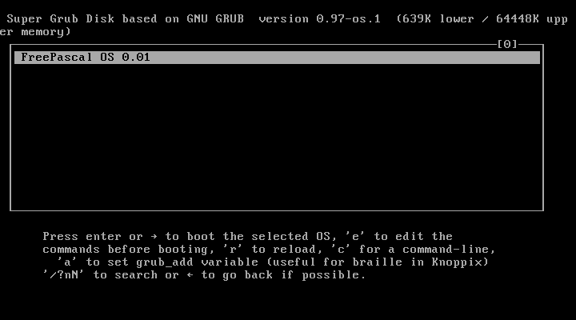
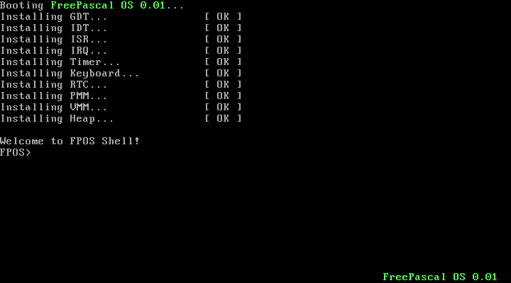
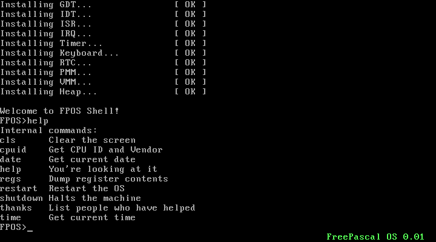

# FPOS - Free Pascal Operating System

 

  

   Project started in 01-01-2010 and coded with ❤️

## Introduction :

FPOS is a operating system consists of a minimal kernel built on FreePascal. It contains a Scheme implementation of a hard drive (ATA) driver, keyboard (PS2), serial (8250 UART), FAT32 filesystem and a small real time clock manager. The project was built to experiment with developement of operating system using a high level functional language to study the developement process and the use of Scheme to build a fairly complex system.
  

Boot             |  Shell (CLI) | Command (Help)
:-------------------------:|:-------------------------:|:-------------------------:
  |  |  

🤝 Bugs and help / improvements will be appreciated, please send them to (Yacine REZGUI) yacine.rezgui@gmail.com and (Mario Ray Mahardhika) leledumbo_cool@yahoo.co.id.

## :heavy_check_mark: Implemented :
- [x] GDT, IDT       ( no problem... I hope )
- [x] ISR            ( currently, only page fault has additional handler )
- [x] IRQ            ( no problem... I hope  )
- [x] Console        ( including simple command processing )
- [x] Keyboard       ( try to be US-std, but I don't know the keymap. Just guessing for now )
- [x] Memory Manager ( needs testing )
- [x] Speaker        ( just for fun :-) )
- [x] RTC            ( seems wrong at PM, also for DayOfWeek )
- [ ] System calls
- [ ] Multitasking
- [ ] Filesystem     ( perhaps FAT12 is the most obvious, or should we create one ourselves? )

## 🔧 Fixed :
- Successive Write(Ln) fails due to 103 IOResult
- Some inline assembler and assembler routines are missing register list, causing it to crash randomly (please test)

## 📋 Changed :
- Updated to FPC RTL revision 14499

## ➕ Added :
- Not 📅 planned for now

## 📝 Note :
- Some files are not used due to unusability ( multitasking & filesystem )

# ⚙️ How to compile :
- Make sure you have working FPC installation ( try using latest 2.5.x snapshot if your version fails )
- Copy executables** under tools to a directory listed in your PATH ( or Path )
- Open Command Prompt ( start->run->cmd ), cd to fpos top directory, then type 'make'

## ⚗️ How to test :
- Adapt **(Qemu or Bochs).bat** to your Qemu / Bochs installation
- On Linux, you must change 'i386-linux-ld' in make.rules to 'ld'

## ❤️ Contributing
Contributions, issues and feature requests are welcome!

## 📓 License

The  GPL-2.0 License. Please see [License File](LICENSE.md) for more information.

## 🌳 Treeware
This Operating System is a Treeware. If you use it in production, then we ask that you buy the world a tree to thank us for our work. By contributing to the Treeware forest you’ll be creating employment for local families and restoring wildlife habitats. Read more about Treeware at [treeware.earth](http://treeware.earth)
